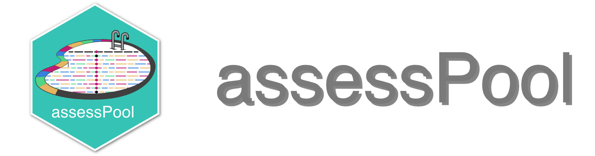

<h1>
  <picture>
    <source media="(prefers-color-scheme: dark)" srcset="docs/images/logo.png" >
    
  </picture>
</h1>

[](https://zenodo.org/badge/latestdoi/914556234)
[](https://www.nextflow.io/)
## Introduction

**assessPool** is a population genetics analysis pipeline designed for pooled sequencing runs (pool-seq). Starting from raw genomic variants (VCF or sync format), assessPool performs the following operations:

  * Filters SNPs based on adjustable criteria with suggestions for pooled data
  * Calculates population genetic statistics using [PoPoolation2](https://sourceforge.net/p/popoolation2/wiki/Main/), [poolfstat](https://doi.org/10.1111/1755-0998.13557), and/or [grenedalf](https://github.com/lczech/grenedalf).
  * Generates an HTML report including visualizations of population genetic statistics
  * Outputs results in tabular format for downstream analyses

Required inputs are a variant description file (sync or VCF) and a reference assembly (FASTA). These can be output from any number of reduced representation data processing pipelines (e.g., [grenepipe](https://github.com/moiexpositoalonsolab/grenepipe), [dDocent](https://ddocent.com/), etc.).

Major pipeline operations:

1. Import, index, and/or compress variant description and reference
1. Perform stepwise filtering to determine effects of individual filter options (count lost loci):
    1. Min/max read depth
    1. Minor allele count
    1. Hardy-Weinberg equilibrium cutoff
    1. Missing data
    1. Allele length
    1. Quality:depth ratio
    1. Minimum read quality
    1. Variant type
    1. Mispaired read likelihood
    1. Alternate observations
    1. Mapping quality
    1. Mapping ratio
    1. Overall depth
    1. Number of pools with data
    1. Read balance
    1. Variant thinning
1. Perform cumulative filtering (for VCF input)
1. Generate sync files
    1. Unified (all pools)
    1. Split pairwise
1. Generate allele frequency table
1. Calculate F<sub>st</sub>
    1. PoPoolation2
    1. &#123;poolfstat&#125;
    1. grenedalf
1. Calculate Fisher's exact test for individual SNPs
    1. PoPoolation2
    1. assessPool native
1. Join frequency data to F<sub>st</sub> results
1. Extract contigs containing (user-configurable) strongly-differentiated loci
1. Create HTML report
1. Save all output data in tabular format for downstream analysis


## Usage

> [!NOTE]
> If you are new to Nextflow and nf-core, please refer to [this page](https://nf-co.re/docs/usage/installation) on how to set-up Nextflow. Make sure to [test your setup](https://nf-co.re/docs/usage/introduction#how-to-run-a-pipeline) with `-profile test` before running the workflow on actual data.

First, prepare a sample sheet with your input data that looks as follows:

`samplesheet.csv`:

```csv
project,input,vcf_index,reference,pools,pool_sizes
poolseq_test,data/pools.vcf.gz,data/pools.vcf.gz.tbi,data/ref.fasta,,"35,38,22,52,17,19"
```

Each row represents a complete pool-seq project or experiment. Column descriptions:

`project` (required): A brief unique identifier for this pool-seq project  
`input` (required): Variant description file in sync or VCF format (optionally compressed using `bgzip`)  
`vcf_index` (optional): TABIX-format index of the input VCF file (generated if not supplied)  
`reference` (required): Reference assembly (FASTA)  
`pools` (optional): Comma-separated list of pool names (will replace any names in the input file)  
`pool_sizes` (required): Number of individuals in each pool. Either a single number for uniform pool sizes or a comma-separated list of sizes for each pool.


Required columns are `project`, `input`, `reference`, and `pool_sizes`.

Now, you can run the pipeline using:

```bash
nextflow run tobodev/assesspool \
   -profile <docker/singularity/.../institute> \
   --input samplesheet.csv \
   --outdir <OUTDIR>
```

> [!WARNING]
> Please provide pipeline parameters via the CLI or Nextflow `-params-file` option. Custom config files including those provided by the `-c` Nextflow option can be used to provide any configuration _**except for parameters**_; see [docs](https://nf-co.re/docs/usage/getting_started/configuration#custom-configuration-files).

For more details and further functionality, please refer to the [usage documentation](docs/usage.md) and the [parameter documentation](parameters.md).

## Testing the pipeline
assessPool comes with two built-in profiles that allow the user to test the pipeline with a fully-functional input dataset. These profiles (whose descriptions can be found in [conf/test.confg](conf/test.config) and [conf/test_full.config](conf/test_full.config)) will run assessPool with either a full or reduced dataset of SNPs sequenced from wild populations of the coral *Montipora capitata*. Pipeline tests can be run by passing either `test` or `test_full` to the `-profile` option, along with a software/container management subsystem. For example, using singularity:

```
nextflow run tobodev/assesspool \
  -profile test,singularity
```
or
```
nextflow run tobodev/assesspool \
  -profile test_full,singularity
```

## Pipeline output

Results of an example test run with a full size dataset can be found [here](https://tobodev.github.io/assesspool/).  
For more details about the output files and reports, please refer to the
[output documentation](docs/output.md).

## Credits

assessPool was originally written by Evan B Freel, Emily E Conklin, Mykle L Hoban, Derek W Kraft, Jonathan L Whitney, Ingrid SS Knapp, Zac H Forsman, Robert J Toonen.

We thank the following people for their extensive assistance in the development of this pipeline:

Richard Coleman, &#x02bb;Ale&#x02bb;alani Dudoit, and Cataixa López, who used assessPool during development and helped identify issues and suggest key feature improvements. We would also like to thank Iliana Baums, Tanya Beirne, Dave Carlon, Greg Conception, Matt Craig, Jeff Eble, Scott Godwin, Matt Iacchei, Frederique Kandel, Steve Karl, Jim Maragos, Bob Moffitt, Joe O'Malley, Lawrie Provost, Jennifer Salerno, Derek Skillings, Michael Stat, Ben Wainwright, and Kim Weersing, for their efforts in sample collection.

## Contributions and Support

If you would like to contribute to this pipeline, please see the [contributing guidelines](.github/CONTRIBUTING.md).

## Citations

A list of references for the tools used by the pipeline can be found in the [`CITATIONS.md`](CITATIONS.md) file.

This pipeline uses code and infrastructure developed and maintained by the [nf-core](https://nf-co.re) community, reused here under the [MIT license](https://github.com/nf-core/tools/blob/master/LICENSE).

> The nf-core framework for community-curated bioinformatics pipelines.
>
> Philip Ewels, Alexander Peltzer, Sven Fillinger, Harshil Patel, Johannes Alneberg, Andreas Wilm, Maxime Ulysse Garcia, Paolo Di Tommaso & Sven Nahnsen.
>
> Nat Biotechnol. 2020 Feb 13. doi: 10.1038/s41587-020-0439-x.
